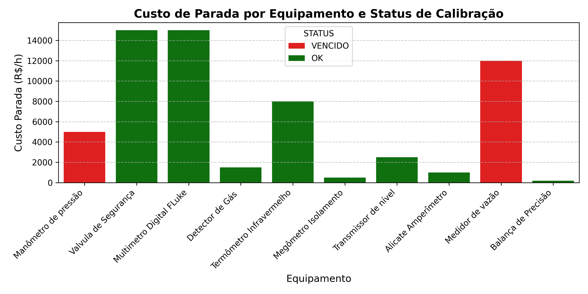

# 🛡️ Gestão de Risco Operacional e Confiabilidade Metrológica em Ativos Industriais

## 📌 Visão Geral do Projeto

Este projeto apresenta um modelo analítico de **Gestão de Risco e Confiabilidade de Ativos Industriais**, focado no dimensionamento do impacto financeiro decorrente de não conformidades em calibração/manutenção metrológica.

Em setores de alta exigência (como Óleo & Gás, Petroquímica e Navegação Offshore), a falta de calibração em instrumentos críticos representa riscos severos de **SMS (Segurança, Meio Ambiente e Saúde)**, interrupções não planejadas (*Downtime*) e multas contratuais.

---

## 📊 Principais Indicadores (KPIs)

Através da modelagem analítica realizada em Python, foram consolidados os seguintes indicadores de risco em relação aos ativos com calibração **VENCIDA**:

| Indicador | Valor Calculado | Impacto Operacional |
| :--- | :---: | :--- |
| **Risco Exposto / Hora** | **R$ 19.500,00 /h** | Custo acumulado de parada não planejada caso os ativos falhem. |
| **Risco Exposto / Dia (24h)** | **R$ 468.000,00 /dia** | Perda financeira potencial em caso de paralisação total da linha. |
| **Custo Total de Regularização** | **R$ 1.900,00** | Investimento necessário em serviços metrológicos/calibração. |
| **ROI da Manutenção** | **~ 6 Minutos** | O custo para calibrar 100% dos ativos equivale a apenas 6 minutos de parada. |

---

## 📈 Visualização do Risco Financeiro por Ativo

### 🚨 Ativos Críticos Identificados em Estado VENCIDO:
1. **Medidor de Vazão (`FLO-008`):** Custo de parada de **R$ 12.000,00/h** (Critício para medição fiscal e custódia).
2. **Manômetro Digital (`MAN-001`):** Custo de parada de **R$ 5.000,00/h** (Risco de SMS em linhas de injeção de alta pressão).
3. **Termorresistência Pt100 (`TER-003`):** Custo de parada de **R$ 2.500,00/h** (Desvio no controle térmico de processo).

---

## 💡 Plano de Ação e Gestão de Processos (TO-BE)

Com base no cruzamento entre **Criticidade Técnica** e **Custo de Parada**, é proposto o seguinte fluxo de gestão:

1. **Priorização e SLA Emergencial:**
   * Emitir Ordens de Serviço (OS) prioritárias com janela de atendimento de 24h para os ativos `FLO-008` e `MAN-001`.
2. **Implantação de Buffer Metrológico:**
   * Criar rotinas automáticas de alerta com **60, 30 e 15 dias de antecedência** ao vencimento, integrando o planejamento de manutenção com a equipe de suprimentos (*Procurement*).
3. **Gestão de Fornecedores (Contrato Guarda-Chuva):**
   * Estabelecer contrato com laboratórios metrológicos credenciados RBC/INMETRO em Macaé/RJ com SLA garantido de calibração em no máximo 48 horas.

---

## 🛠️ Tecnologias e Ferramentas Utilizadas
* **Google Sheets / Excel:** Armazenamento e estruturação do inventário de ativos.
* **Python (Pandas, Matplotlib, Seaborn):** Tratamento de dados, modelagem matemática do risco e geração automatizada de gráficos.
* **GitHub:** Versionamento e documentação executiva do projeto.
